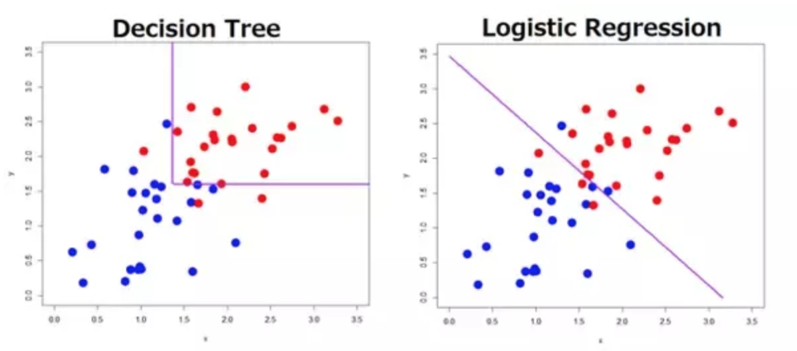

### Summary

This repository contains an analysis of customer churn (also "customer turnover") from the [IBM Watson Analytics sample data sets](https://www.ibm.com/communities/analytics/watson-analytics-blog/guide-to-sample-datasets/)
The analysis [Should I stay or should I go?](https://github.com/marjoleinspronk/StayOrGo/StayOrGoPrediction.ipynb) consists of data cleaning, exploratory visualization, feature preparation, 
and two types of machine learning models (logistic regression and Decision Tree) to predict customer churn for a telecom company.

### Introduction
Customer churn is a way for companies to measure customer loss, and since loss of customers means loss of revenue, companies want to prevent churn as much as possible. 
One way of doing this is to get insight into the factors that are related to customer loss. 
If we know that customers using product A instead of B, or of a certain age, or living in a certain area, 
are more likely to leave than other customers, these groups might for example be offered incentives to stay, or the company could
decide to invest in finding out why they choose to leave and how they can provide better service.   

The analysis done here has the purpose to find the factors that are most important for customer churn in a telecom company. 
Note that this means they are related to, but not necessarily causing customers to leave(!). 

  

### The data

The [sample data set](https://www.ibm.com/communities/analytics/watson-analytics-blog/guide-to-sample-datasets/) contains the following predictors and one target variable (for more info, see notebook):

Demographics:
* Customer ID           
* Gender         
* SeniorCitizen 
* Partner 
* Dependents 
* Tenure 

Telecom products:
* Phone Service 
* Multiple Lines 
* Internet Service 
* Online Security
* Online Backup 
* Device Protection 
* Tech Support 
* Streaming TV 
* Streaming Movies 

Payment details:
* Contract type
* Paperless Billing 
* Payment Method 
* Monthly Charges 
* Total Charges

Target variable:
* Churn 
  
  
### Machine Learning

Before trying to predict customer churn, an exploratory data analysis (EDA) using visualization was done to see if there were any clear patterns, anomalies, and to test some hypotheses. 

Since the goal here is to classify churn vs. no churn, two types of models were explored to predict customer behavior: Logistic Regression and Decision Tree.
The difference in classification approach (how decision boundaries are generated) is illustrated in the following plot:

  

In short, decision trees make multiple splits of the data, resulting in smaller and smaller areas (note that only one split is displayed in the figure above), and logistic regression fits one single line between the data points to divide the space in churn vs no churn.  
Scikit learn was used for machine learning.

### Summary of findings 

In total, three models (2 logistic regression and 1 decision tree) were tested to see what the predictive performance of the logistic regression and decision tree algorithms in this problem would be.  

The models were able to make a reasonably good (but not exellent) prediction about which customers were likely to churn.     
Although the accuracy of the models (and precision and recall) were more or less similar for the 3 models (around 79%, with precision and recall around 0.78 and 0.79 respectively), the features that were marked as important differed somewhat. 
However, all models suggest that **Contract Type** and **Internet Service** are good predictors of churning, and two models indicate that **Monthly Charges** should be taken into account.

### Files you'll find in this repository are:

* [StayOrGoPrediction.ipynb]((https://github.com/marjoleinspronk/StayOrGo/StayOrGoPrediction.ipynb)) is a jupyter notebook with the analysis code.
* [data/WA\_Fn-UseC_-Telco-Customer-Churn.csv]((https://github.com/marjoleinspronk/StayOrGo/data/WA\_Fn-UseC_-Telco-Customer-Churn.csv)) contains the data used in this notebook.

